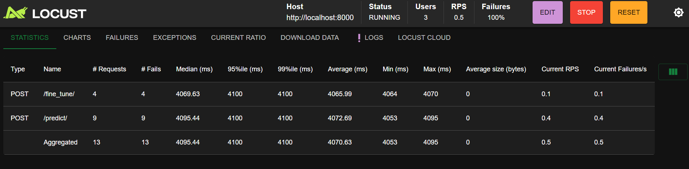

# 🩺 Hypertension Prediction API

This project is a machine learning-based API for predicting hypertension risk using health and lifestyle indicators. It allows for:
- 🧠 Real-time predictions
- 🔄 Model retraining with new datasets
- 🛠️ Fine-tuning of an existing model
- ⚡ Load testing with [Locust](https://locust.io)

---

## 📁 Project Structure

```
├── env/                  # Virtual environment
├── models/               # Stores trained model (.pkl) and scaler
├── notebook/             # Jupyter notebooks for exploration & training
├── src/                  # Source code (model creation, preprocessing)
│   ├── model.py
│   └── preprocessing.py
├── .gitignore
├── image.png             # Sample image (optional)
├── locustfile.py         # Locust performance test
├── main.py               # FastAPI application
├── requirements.txt      # Python dependencies
├── README.md             # Project documentation
└── sample_data.csv       # Sample dataset
```

---

## 🚀 Getting Started

### 1. Clone the Repository

```bash
git clone <repo-url>
cd <repo-folder>
```

### 2. Create & Activate Environment

```bash
python -m venv env
source env/bin/activate  # On Windows: env\Scripts\activate
```

### 3. Install Dependencies

```bash
pip install -r requirements.txt
```

---

## 🧠 API Endpoints

### Base URL
```http
http://localhost:8000
```

### 1. `GET /`
Health check for the API.

### 2. `POST /predict/`
Predict if a user is hypertensive or not based on 10 input features.

**JSON Input Example:**
```json
{
  "Age": 45,
  "Weight": 72,
  "BP_History": 1,
  "Medication": 0,
  "Family_History": 1,
  "Exercise_Level": 2,
  "Smoking_Status": 0,
  "Cholesterol_Level": 1,
  "Salt_Intake_Level": 2,
  "Alcohol_Consumption": 1
}
```

**Response Example:**
```json
{
  "prediction": "Hypertensive",
  "probability": 0.84
}
```

---

### 3. `POST /retrain/`
Retrain the model from scratch using a new CSV dataset (must have same structure).

**Payload:** CSV File  
**Response:** JSON with retraining accuracy.

---

### 4. `POST /fine_tune/`
Fine-tune the current model with additional data.

**Payload:**
- CSV file
- Optional `epochs` (default: 5)

---

## 📦 File Format for Upload

CSV must have the following columns:

```
Age,Weight,BP_History,Medication,Family_History,Exercise_Level,Smoking_Status,Cholesterol_Level,Salt_Intake_Level,Alcohol_Consumption,Has_Hypertension
```

---

## ⚙️ Run the API

```bash
uvicorn main:app --reload
```

---

## 📈 Load Testing with Locust

1. Install Locust if not yet installed:

```bash
pip install locust
```

2. Run load tests:

```bash
locust -f locustfile.py
```

3. Visit: [http://localhost:8089](http://localhost:8089)

---

## 🧪 Example locustfile.py

```python
from locust import HttpUser, task

class APILoadTest(HttpUser):
    @task
    def predict(self):
        self.client.post("/predict/", json={
            "Age": 45,
            "Weight": 72,
            "BP_History": 1,
            "Medication": 0,
            "Family_History": 1,
            "Exercise_Level": 2,
            "Smoking_Status": 0,
            "Cholesterol_Level": 1,
            "Salt_Intake_Level": 2,
            "Alcohol_Consumption": 1
        })
```

---

## 🛡️ Notes

- Ensure consistent input schema when retraining or fine-tuning.
- Models are saved as `.pkl` using `pickle`; avoid version mismatches.
- Frontend clients can interact with the API using CORS.

---

##LOcustImage 
# mlopss
"# mlop" 
